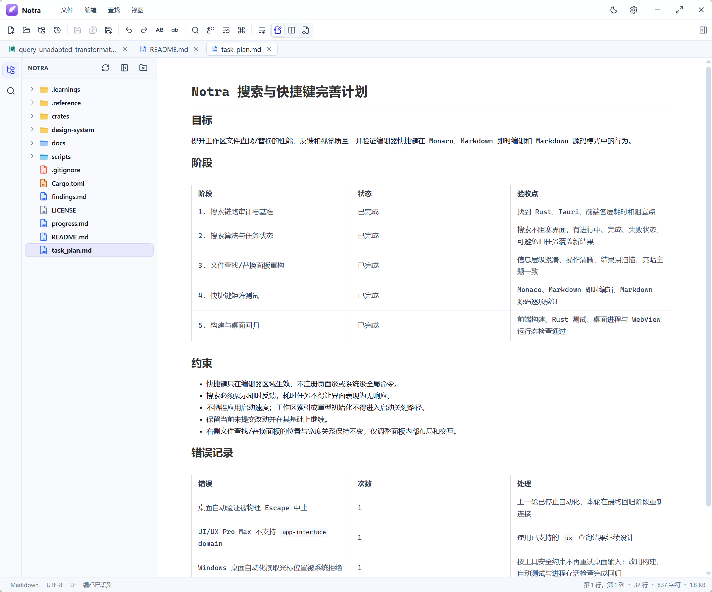

<p align="center">
  
</p>

<h1 align="center">Notra</h1>

<p align="center">轻量、快速、面向文本与 Markdown 的桌面编辑器。</p>

<p align="center">
  <a href="LICENSE"></a>
  
  
  
</p>

Notra 将 Notepad++ 的轻量文件编辑体验、VS Code 的工作区导航，以及 MarkText 风格的 Markdown 即时编辑整合在一个本地优先的桌面应用中。编辑器基于 Monaco，桌面外壳和文件能力由 Tauri 与 Rust 提供。



## 主要功能

- 单文件与工作区模式，可直接打开文件或目录，也支持拖放文件。
- Monaco 编辑内核，提供多语言语法高亮、代码提示、折叠、括号匹配、多光标和大文件优化。
- VS Code 与 Notepad++ 两套快捷键方案，支持按命令分组查看和自定义。
- Markdown 默认即时编辑，并可切换源码或分屏预览模式。
- Markdown 支持大纲、表格、任务列表、数学公式、网络图片，以及 Mermaid、PlantUML 和 Vega 图表。
- 当前文件、打开文档与工作区搜索，支持普通、扩展和正则表达式模式及替换预览。
- UTF-8、UTF-8 BOM、UTF-16 和 ANSI 编码识别与转换，可切换 LF、CRLF 和 CR 行尾。
- 临时文档、打开标签、窗口位置、工作区、搜索历史和编辑设置均可恢复。
- 自绘标题栏、亮色与深色主题、文件类型图标和可调整的编辑器外观。

## 当前状态

Notra 仍在持续开发中。GitHub Releases 提供 Windows x64、macOS ARM64 与 Linux x64 安装包，其中 Windows 10/11 是当前主要测试平台，macOS 与 Linux 版本由 GitHub Actions 自动构建。

Windows 安装包可从 [GitHub Releases](https://github.com/syscryer/Notra/releases) 获取。

## 本地开发

需要以下环境：

- Rust stable
- Node.js 20.19 或更高版本
- npm 8 或更高版本
- Windows WebView2 Runtime

安装前端依赖：

```powershell
cd crates\notra-app\frontend
npm install
```

启动桌面开发模式：

```powershell
cd crates\notra-app
cargo tauri dev
```

构建 Windows 安装包：

```powershell
cd crates\notra-app
cargo tauri build
```

产物位于 `target\release\bundle`。

## 验证

```powershell
cargo test --workspace

cd crates\notra-app\frontend
npm run test:keybindings
npm run build
```

## 项目结构

```text
crates/notra-app/           Tauri 桌面应用与前端界面
crates/notra-core/          文档、编码、搜索和文件系统核心
crates/notra-app/frontend/  Monaco 与 Markdown 编辑体验
docs/                       产品、架构和界面资料
scripts/                    上游同步及开发脚本
```

## 开源与致谢

Notra 使用 [MIT License](LICENSE) 开源。

Markdown 即时编辑能力基于 [MarkText](https://github.com/marktext/marktext) 的 Muya 编辑器演进，固定的上游版本和许可证保留在 `crates/notra-app/frontend/vendor/marktext-muya`。代码编辑能力由 [Monaco Editor](https://github.com/microsoft/monaco-editor) 提供。各第三方依赖继续遵循其各自许可证。
